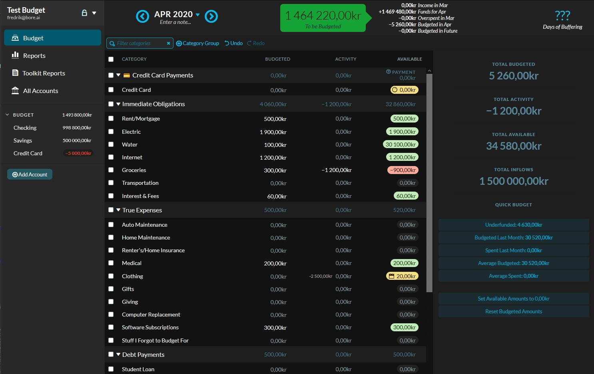
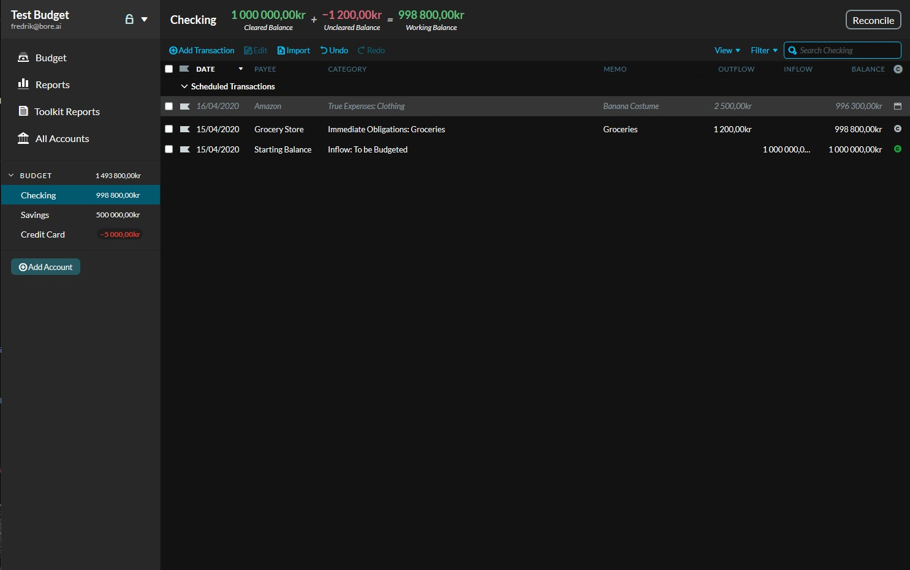
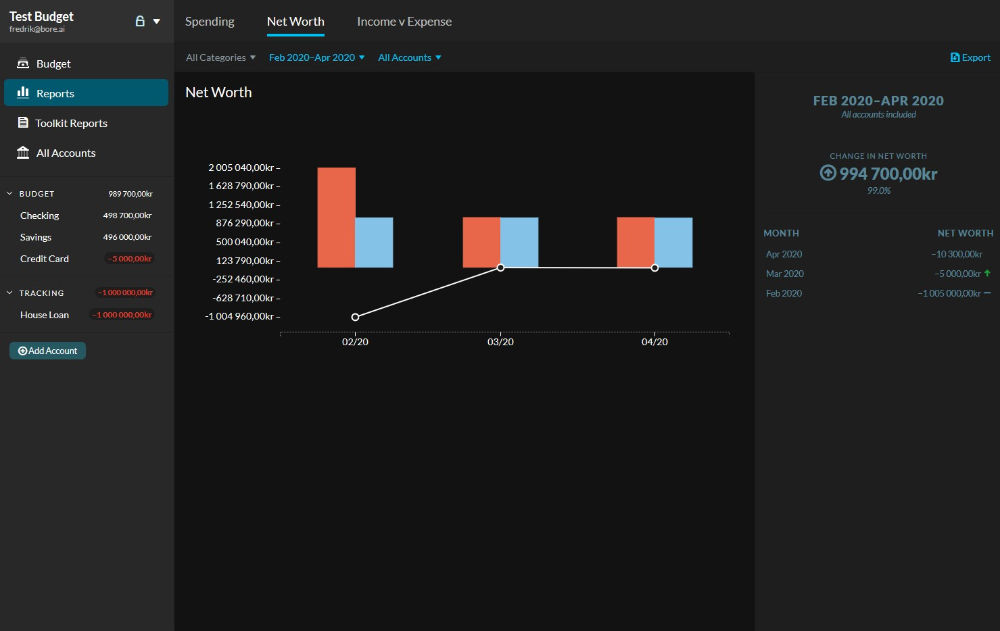
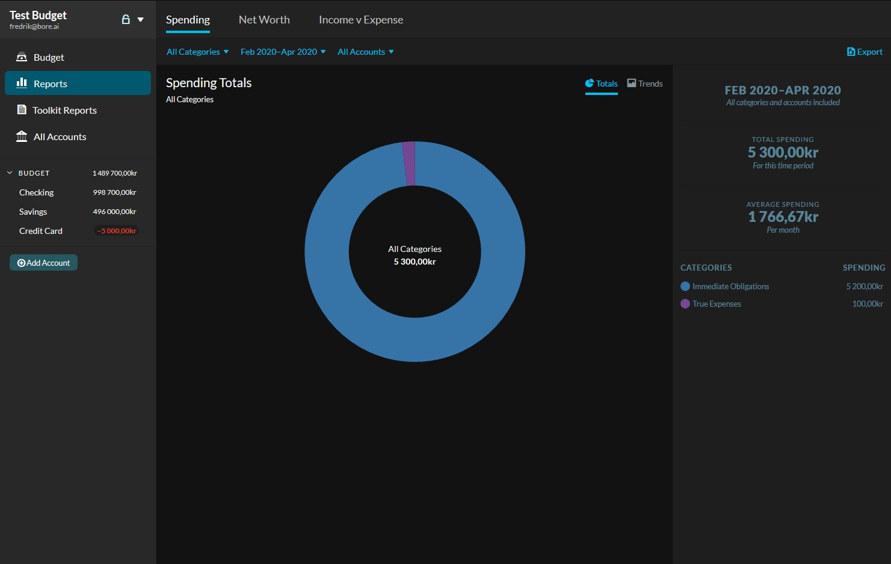
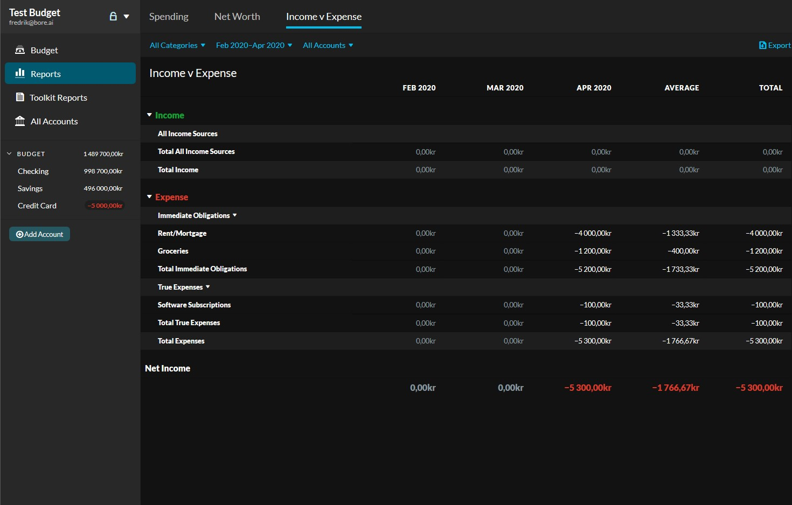

  

  <h3 align="center">Dark YNAB</h3>

  

    Dark theme for You Need A Budget (YNAB)
     
     
    <a href="https://github.com/boren/dark-ynab/issues">Report Bug</a>
    ·
    <a href="https://github.com/boren/dark-ynab/issues">Request Feature</a>
  

## Table of Contents

* [About the Project](#about-the-project)
* [Installation](#installation)
* [Usage](#usage)
* [Contributing](#contributing)

<!-- ABOUT THE PROJECT -->
## About The Project

You Need A Budget is lacking a dark mode. This stylesheet enables dark mode for both YNAB and [Toolkit for YNAB](https://github.com/toolkit-for-ynab/toolkit-for-ynab).
The project aims to mix YNAB style with the [dark theme principles from Material Design](https://material.io/design/color/dark-theme.html).

### Installation
 
1. Install [Stylish](https://userstyles.org/) or another application with support for userstyles
2. Click [ynab-dark.user.css](https://github.com/Boren/dark-ynab/raw/master/ynab-dark.user.css)

## Contributing

Feel free to submit Pull Requests or create issues, preferably with screenshots and a good description of the issue.
